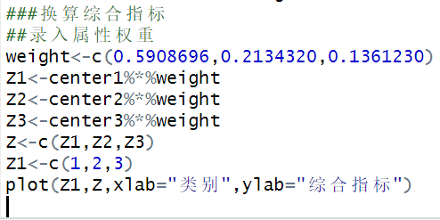
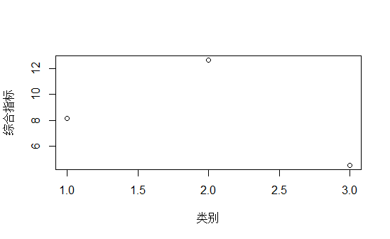

# **基于kmeans算法的NBA球员分类**
1. ## **摘要：**
篮球虽然仅仅诞生了一百多年，但在世界各地都有着巨大的影响力。许多国家都有着自己的篮球赛事，也拥有着众多球迷。这些都形成了独特的篮球文化。

篮球如此受关注，它的运动员们也尤其受到注意。特别是综合能力较强，能够给球队提供帮助的球员。在每年的NBA选秀大会中有的球队不惜通过摆烂的方式得到他们。

NBA作为一种体育文化，利用自身成熟的传播机制和美国文化的强势地位，不仅把精心打造的文化产品通过多种渠道呈现给中国观众，而且通过这一过程，在潜移默化中使人们对以NBA体育文化为代表的美国文化产生了认同感，在享受NBA赛事给我们带来的娱乐的同时，也接受了美国文化中的许多观念。

本文使用R语言软件对2019至2020赛季的NBA球员数据样本进行分类操作，找出每一类球员的特点。使用kmeans算法对样本数据进行聚类分析。首先通过计算样本数据的误差平方和来确定最佳分类数量，然后使用R语言中的kmeans函数对样本数据进行分类。最后，使用主成分分析方法算出数据属性的权重，得出类的综合得分。

## **关键词：kmeans算法、误差平方和、主成分分析**

1. ## **题目背景：**
篮球作为世界上最受欢迎的运动之一，在世界各地有着从事篮球运动的运动员和篮球爱好者们。由于他们对于篮球的热爱形成了独特的篮球文化。

NBA作为世界上最大的篮球赛事，被认为是篮球文化的发源地。最顶尖的篮球运动员都聚集于此，受到了众多篮球迷的追捧。对于NBA的球队来说，如何评判一名球员是否有价值或者是否能够满足球队的需要是一件极其重要的事情。比如，在每年的选秀大会上，几乎每一支球队都想要前20的选秀权甚至是状元。对球队说，实力强劲的球员不仅仅可能是争夺总冠军的拼图，也具有别的方面的价值。

然而，由于每名球员打的的位置不一样，每名球员的能力和技术各不相同，体现的数据也不一样。因此，球队在选择球员前，需要对所有球员进行聚类分析，找出每一类球员的特点。
1. ## **题目目的：**
将NBA球员样本数据进行分类，找出每一类球员的特点。
1. ## **合理假设：**
为保证建立的模型能够顺利使用，现做出以下合理假设：

1. 数据样本来源都真实可靠，无缺失值等。
1. 数据样本只参考2019至2020赛季的数据，不考虑以往赛季。
1. 数据属性只考虑得分、投篮命中率、三分命中率和罚球命中率。
1. 假定样本数据之间的距离计算方法使用的是欧氏距离计算方法。
1. 变量说明：

|player|原始数据集|
| - | - |
|player1|数据样本|
|km|Kmeans聚类结果|
|centers|质心|
|dist|数据样本到质心的欧几里得距离平方|
|Dist|每类数据样本到质心的欧几里得距离平方之和|
|SSE|误差平方和|
|Data1|第一类数据|
|Data2|第二类数据|
|Data3|第三类数据|
|princomp|主成分分析|
|loading|载荷矩阵|
|center1|类1质心|
|center2|类2质心|
|center3|类3质心|
|weight|新属性的权重|
|Z1|类1的综合指标|
|Z2|类2的综合指标|
|Z3|类3的综合指标|

1. ## **数据分析与介绍：**
## **数据导入：**
本文采用NBA中文数据库网站的数据，选取50名球员的数据作为数据样本。选取的数据属性有：得分、投篮命中率、三分命中率和罚球命中率。所得到的数据如下所示：

|球员|得分|投篮命中率|三分命中率|罚球命中率|
| :- | :- | :- | :- | :- |
|扬尼斯-阿德托昆博|30\.5|0\.554|0\.327|0\.597|
|詹姆斯-哈登|38\.3|0\.458|0\.378|0\.865|
|卢卡-东契奇|28\.8|0\.475|0\.324|0\.813|
|安东尼-戴维斯|27\.3|0\.5|0\.287|0\.853|
|乔尔-恩比德|23\.7|0\.477|0\.339|0\.834|
|勒布朗-詹姆斯|25\.1|0\.487|0\.345|0\.688|
|科怀-伦纳德|25\.6|0\.455|0\.369|0\.882|
|哈桑-怀特塞德|15\.4|0\.608|0\.5|0\.76|
|达米安-利拉德|27|0\.442|0\.356|0\.898|
|克里斯蒂安-伍德|9\.3|0\.623|0\.395|0\.655|
|米切尔-罗宾逊|10|0\.688|0|0\.616|
|尼科拉-约季奇|18|0\.498|0\.31|0\.81|
|吉米-巴特勒|20\.5|0\.425|0\.276|0\.83|
|布兰登-克拉克|13|0\.647|0\.457|0\.766|
|特雷-杨|28\.5|0\.444|0\.368|0\.845|
|安德烈-德拉蒙德|18|0\.551|0|0\.612|
|蒙特雷斯-哈雷尔|19|0\.574|0|0\.663|
|贾莱特-阿伦|12\.2|0\.658|0|0\.634|
|诺伦斯-诺尔|7\.8|0\.671|0|0\.815|
|德里克-罗斯|16\.7|0\.491|0\.321|0\.877|
|布兰顿-英格拉姆|25\.3|0\.491|0\.409|0\.857|
|肯巴-沃克|22\.5|0\.43|0\.397|0\.873|
|史蒂文-亚当斯|11\.6|0\.619|0|0\.511|
|伊维察-祖巴茨|8\.5|0\.587|0|0\.739|
|拉玛库斯-阿尔德里奇|19\.5|0\.511|0\.404|0\.832|
|理查恩-福尔摩斯|12\.8|0\.664|0|0\.821|
|约纳斯-瓦兰丘纳斯|14\.4|0\.59|0\.439|0\.742|
|贾维尔-麦基|7|0\.638|1|0\.629|
|克里斯-保罗|16\.6|0\.468|0\.372|0\.904|
|德安德鲁-乔丹|8\.1|0\.643|0|0\.672|
|鲁迪-戈波特|14\.9|0\.688|0|0\.609|
|克里斯-布歇|6\.4|0\.467|0\.333|0\.77|
|克里斯-米德尔顿|18\.7|0\.49|0\.408|0\.897|
|布拉德利-比尔|27\.8|0\.436|0\.317|0\.828|
|埃德里斯-阿德巴约|15\.6|0\.562|0\.111|0\.686|
|克林特-卡佩拉|13\.9|0\.642|0|0\.486|
|马尔科姆-布罗格登|18\.3|0\.451|0\.333|0\.933|
|多诺万-米切尔|25\.3|0\.458|0\.355|0\.831|
|乔治-希尔|10\.6|0\.56|0\.53|0\.843|
|德隆-莱特|7\.9|0\.5|0\.373|0\.872|
|杰伦-布朗|20\.6|0\.518|0\.4|0\.752|
|德玛尔-德罗赞|21\.1|0\.52|0\.263|0\.809|
|斯宾瑟-丁维迪|22\.5|0\.428|0\.298|0\.807|
|帕斯卡尔-西亚卡姆|25\.1|0\.457|0\.392|0\.813|
|多曼塔斯-萨博尼斯|17\.4|0\.504|0\.273|0\.737|
|德文-布克|24\.7|0\.503|0\.364|0\.898|
|艾森-伊利亚索瓦|8\.3|0\.519|0\.392|0\.792|
|科迪-泽勒|11\.7|0\.543|0\.283|0\.68|
|埃里克-布莱索|15|0\.477|0\.344|0\.813|
|本-西蒙斯|14\.4|0\.559|0\.4|0\.579|

由于原始数据具有其他不同的属性，但大部分的属性不被考虑，所以需要进行数据预处理将不需要的数据属性去除，保留需要的属性，使数据集能够适应算法。
## **计算误差平方和：**
kmeans算法在将数据样本聚类之前，需要提前知道样本数据需要聚成几类。聚成几类需要按照客户的需求。当不知道应该聚成几类时，可以考虑计算误差平方和来求得类数。

首先需要将样本先进行kmeans分类。然后计算每个数据点的误差，即计算它到样本质心的距离。然后再将样本进行重新分类，重复计算误差平方和。误差平方和越小，越好。因为这说明聚类的质心可以更好地代表类中心。误差平方和地计算形式如下：

其中，是欧几里得空间中两个对象之间地标准欧几里得距离()。

本文在对数据集进行分类之前，要先计算样本的误差平方和。自定义计算的函数，迭代的次数取1到9次，反复调用kmeans函数，并画出误差平方和的散点图，找出最低点。所求出的最低点就是所要求的最佳分类数量。
## **kmeans聚类：**
在算出误差平方和，确定好最佳分类数量后，就需要使用kmeans算法进行分类。kmeans的基本算法是：首先，选择K个初始质心，其中K是用户指定的参数，即所期望的类的数量。每个数据点指派到最近的质心，指派到一个质心的点集为一个类。然后，根据指派到类的点更新每个类的质心，多次调用直到类质心不再发生变化。

在R语言中kmeans算法可以通过kmeans函数实现，在kmeans算法中，默认的距离是欧氏距离。在计算中也默认采用欧氏距离。类质心的计算公式如下：

其中x是是属于这个类的数据集，质心就是数据集的属性值的平均值。
## **主成分分析：**
在数据样本中，数据集的属性可能有非常多种。其中的一些属性对于数据样本有着重复的信息量。会使数据处理变的复杂和困难。

主成分分析是一种通过构建新属性来降低数据样本的维度的方法，其中构建的属性数量不能超过原属性的数量。即主成分分析是以丢失最少信息量为前提，将众多数据属性变成几个综合指标。

此外，主成分分析还能求得新属性的贡献率，其中第一主成分对于原属性集的提取量最多。因此，第一主成分的贡献率应该最大，其次是第二主成分。之后，以此类推。

在这里，我们可以把贡献率当作新属性的权重。贡献率越大的主成分的权重越大。
1. ## **建模：**
综合指标=权重\*属性1+权重\*属性2+权重\*属性3+权重\*属性4
## **数据导入：**

使用openxlsx包将需要的原始数据导入，以及提取有用数据。
## **计算误差平方和：**

通过不断调用kmeans函数并计算出数据样本到各个类的距离，求出误差平方和。然后画出误差平方和的散点图，求得最佳聚类数目为3。
## **kmeans聚类：**

按照计算出的误差平方和对原数据集进行分类。Data1为第一类数据，Data2为第二类数据，Data3为第三类数据。center分别为对应类的质心。

画出第一类数据的核密度函数曲线图和雷达图，需要安装程序包fmsb。

画出第二类数据的核密度函数曲线图和雷达图。

画出类3的核密度曲线和雷达图。
## **主成分分析：**

对数据集先进行标准化，然后算出数据集的相关矩阵，进行主成分分析，求出载荷矩阵并显示出结果。
1. ## **模型结果与评价：**
## **计算误差平方和：**

从误差平方和的散点图中可以看出，当质心取3时，误差平方和SSE是最小的。所以可以得出最佳的聚类个数为3个。
## **kmeans聚类：**
类1核密度曲线：

类1雷达图：

从类1的核密度函数图和雷达图中可以看出，类1的得分大多集中在25分附近，投篮命中率集中在0.5附近，三分命中率集中在0.35附近，罚球命中率在0.6和0.7附近有一小部分，大部分集中在0.85。

类2核密度曲线：

类2雷达图：

从类2的核密度函数图和雷达图中可以看出，类2的得分有两个比较集中的点分别是在15分附近和19分附近，投篮命中率是在0.48附近，三分球命中率集中在0和0.4附近，罚球命中率则集中在0.83附近。

类3核密度曲线：

类3雷达图：

类3的得分分布在9分和11分附近。投篮命中率分布在0.64附近。三分球命中率大部分分布在0附近，有一部分分布在0.45附近，还有一小部分分布在1附近。罚球命中率在0.65和0.83附近。
## **主成分分析：**

使用主成分分析方法求得新属性的权重。先求出相关矩阵，再对数据集进行标准化。使用princomp()函数进行主成分分析，求出载荷矩阵，用summary()函数显示结果。

Proportion of Variance是每个新属性的贡献率。Cumulative Proportion是累计贡献率。Loading是载荷矩阵。当新属性的个数取3时，累计贡献率已经达到0.94。说明从原数据集中提取了94%的信息。因此，可以就取前三个属性。每个属性的贡献率可以当作属性的权重。

接着录入载荷矩阵，将各个类质心进行转换，形成新的质心。

最后，与属性权重相乘算出各个类的综合指标并画出散点图。从最后画的散点图中可以看出，第二类球员的综合指标最好。他们的得分、投篮命中率、三分球命中率和罚球命中率都比较好。所以，第二类球员比较均衡，是球队需要的球员。

其次的是第一类球员，这类球员得分能力比较出色。但是别的能力与第二类球员相比有一定差距，所以综合指标没有第二类球员高。但这类球员属于特色球员，在球队需要强力的得分手时，这类球员可以变成一大助力。

综合指标最低的是第三类球员。这类球员往往有可能是年轻球员或者年迈的球员。年轻球员可能是因为技术不到位或者上场时间受限等原因，年迈球员最大的可能是身体素质的下降，难以跟上高强度的比赛。对于这类球员，球队可以考虑培养或者交易。
## **参考文献：**
1. 张良均著，R语言与数据挖掘， 北京：机械工业出版社
1. 范宏建译，数据挖掘导论，北京：人民邮电出版社
